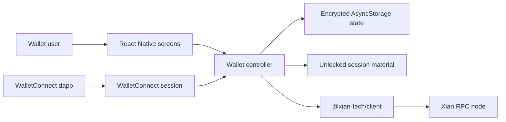

# Architecture

`xian-wallet-mobile` is an Expo / React Native wallet product. It stores
encrypted wallet state locally, signs transactions on-device, reads Xian nodes
through `@xian-tech/client`, and handles mobile-only flows such as secure
store, biometrics, QR scanning, sharing, and WalletConnect sessions.

## Components

- `App.tsx`, `index.ts`: Expo entrypoint and root component.
- `src/navigation/`: stack and tab navigators.
- `src/screens/`: product screens for setup, lock/unlock, balances, send,
  trade, activity, networks, settings, advanced transactions, and apps.
- `src/lib/wallet-controller.ts`: wallet state machine for accounts, locking,
  unlocking, network switching, balances, and submissions.
- `src/lib/wallet-context.tsx`: React context wrapper around the controller.
- `src/lib/storage.ts`, `src/lib/preferences.ts`: local persistence helpers.
- `src/lib/rpc-client.ts`: mobile wrapper around `@xian-tech/client`.
- `src/lib/walletconnect.ts`, `src/lib/walletconnect-policy.ts`,
  `src/lib/signing-policy.ts`: dapp sessions, required-only namespace scope,
  live request authorization, and request-approval policy.
- `src/lib/wallet-backup.ts`: encrypted backup import/export validation.
- `src/lib/biometrics.ts`: biometric unlock support with password fallback.
- `src/theme/`: design tokens and shared styling primitives.

## Runtime Flow



## Dependency Direction

- SDK wire formats and RPC behavior come from the sibling `xian-js` workspace.
- Mobile platform concerns stay in this repo: secure storage, biometrics,
  native builds, share sheets, camera permissions, and device-specific network
  reachability.
- Signing policy is enforced before any dapp or screen request reaches the
  transaction submission path.
- AsyncStorage contains only password-encrypted wallet secrets. SecureStore's
  unlocked record is a device-bound, expiring v2 session-key record with no raw
  private key or mnemonic; restoration decrypts the active account into process
  memory and deletes any legacy or malformed record.
- WalletConnect proposals must require supported Xian permissions on the active
  chain. Optional namespaces are not approved, and queued or automatic requests
  are reauthorized against the live method, chain, and account before signing
  or submission.

## Boundaries

- This repo does not own the browser wallet engine. Any shared wallet-core
  extraction should be designed in the SDK or a dedicated shared package before
  mobile consumes it.
- Build artifacts in `dist/`, Android, and iOS outputs are local or CI outputs,
  not product state.
- Local RPC defaults are for development. Device testing often requires
  emulator or LAN host addresses instead of `127.0.0.1`.

## Validation

```bash
npm install
npm run typecheck
npm run test
```
